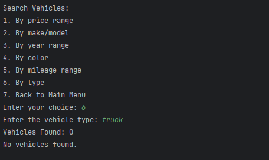
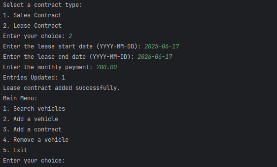
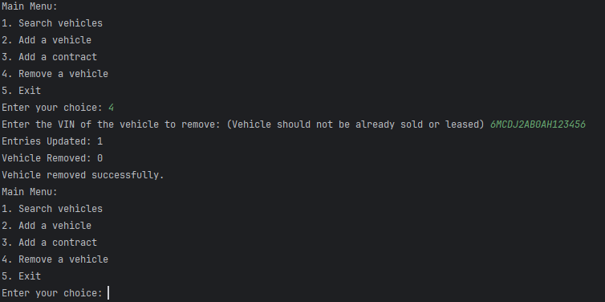

# Car Dealership JDBC Database - Brandon Morse

## The Car Dealership Database holds information regarding vehicles including their vin, sales and lease contracts, date, mileage and more! The user can also create, search, update, delete vehicles based on specific attributes.

## Application Screenshots

### Prerequisites

- MySQL Workbench

## Resources

- [Potato Sensei] (https://chatgpt.com/g/g-681d378b0c90819197b16e49abe384ec-potato-sensei)
- [MySQL Workbench] (https://www.mysql.com/products/workbench/)

## Team Members

- **Brandon Morse** - Application Development and MySQL Querying

## Interesting Code

The VehicleDao has a helper method called createVehicleFromResultSet that is repeated in the searchBy methods that handles the logic of listing and adding the info when searching for a vehicle based on an attribute.

## Thanks!

- Thank you to Mr. Raymond for continuous support and guidance!
